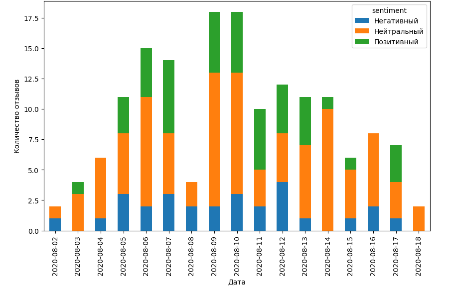
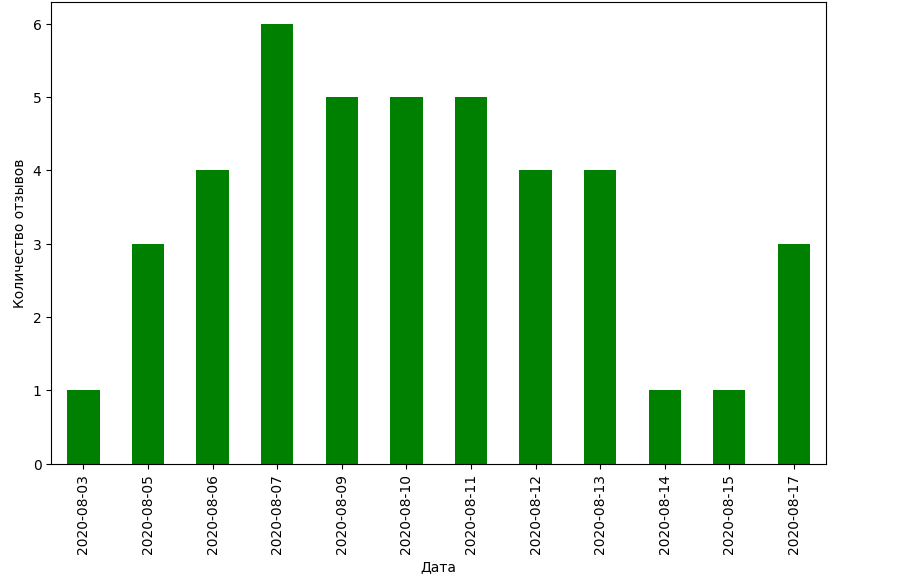
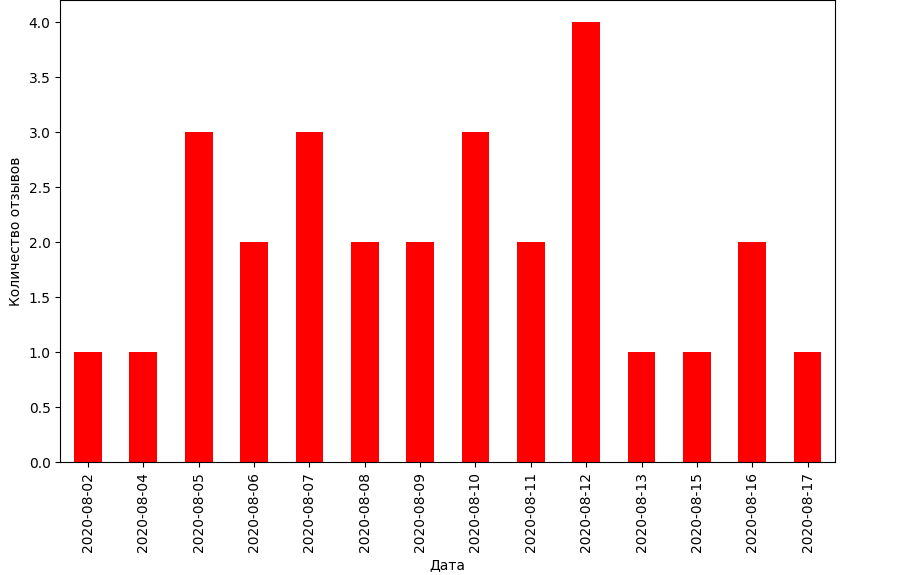

# Анализ текстов для компании XYZ

## Обзор тестовых результатов
1.Дан набот текстов новостей.<br>
2. Отфильтровать по нужной теме<br>
(пока что используется поиск по подстроке, требует дороботки, чтоб искались все вариации и изменения- например, с помощью pymorphy2)<br>
3. Определить тональность текстов<br>
(пока что с помощью TextBlob, но можно доработать - напрмер, использовать Bert)<br>
4. Построить графики изменения тональностей текстов во времени<br>
(ниже приведены графики из которых можно сделать вывод - изначально количество положительных текстов росло, ноь в конце уменьшилось, с негативными -  наоборот)<br>






## Запуск Jupyter Notebook

Для запуска основного файла используйте следующие команды:

```bash
jupyter notebook main.ipynb

В первой строке в переменной tem указать название компании 
```

# Подходы и методы определения репутации компании по текстам новостей

## 1. Анализ тональности (Sentiment Analysis)
Анализ тональности позволяет определить эмоциональную окраску текста (положительная, отрицательная, нейтральная). Этот метод помогает оценить общие настроения и восприятие компании в новостных текстах.

### Основные инструменты:
- **TextBlob**: Простая библиотека для анализа тональности текста.
- **VADER**: Оптимизирован для анализа текста в социальных сетях.
- **NLTK**: Библиотека для обработки текста с различными инструментами для анализа тональности.
- **Transformers (BERT, RoBERTa)**: Мощные модели для точного анализа тональности.

## 2. Классификация текста (Text Classification)
Классификация текста помогает определить категорию или тему текста, что позволяет выявить основные темы обсуждения компании в новостях.

### Основные инструменты:
- **Naive Bayes Classifier**: Простая и быстрая модель для классификации текста.
- **Support Vector Machines (SVM)**: Эффективна для классификации текста.
- **Transformers (BERT)**: Используются для сложных задач классификации.

## 3. Извлечение сущностей (Named Entity Recognition, NER)
Позволяет выделить и классифицировать именованные сущности (например, названия компаний, людей, мест) в тексте, что помогает понять, о какой компании идет речь и в каком контексте.

### Основные инструменты:
- **spaCy**: Библиотека для извлечения именованных сущностей из текста.
- **Natasha**: Русскоязычная библиотека для анализа текста и выделения сущностей.
